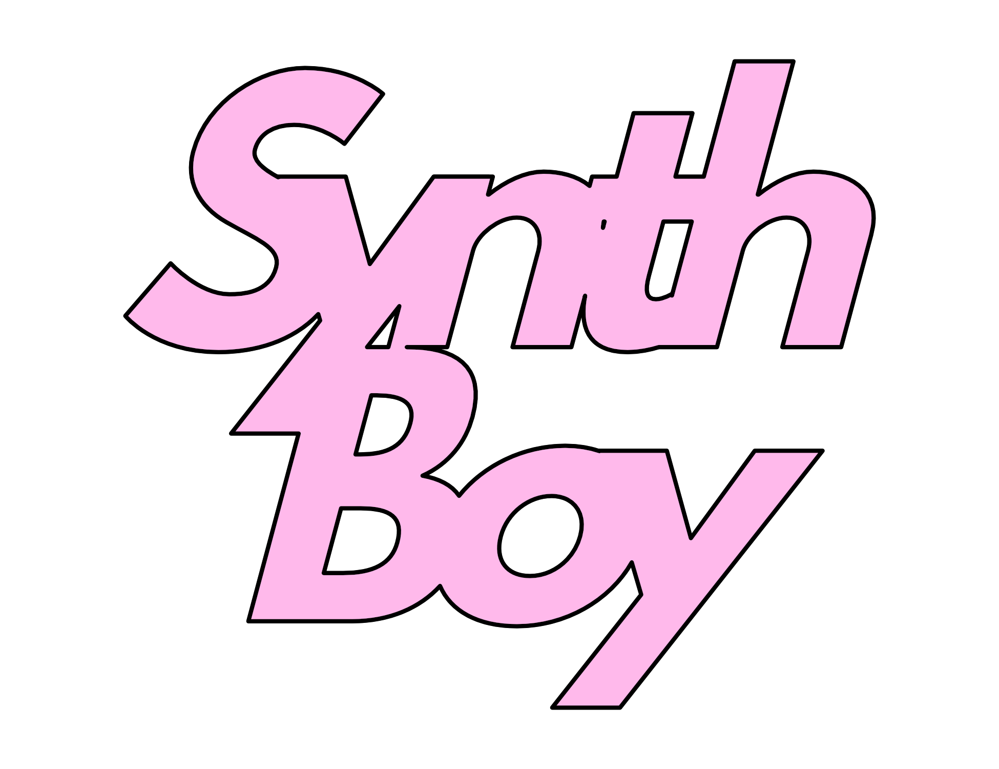
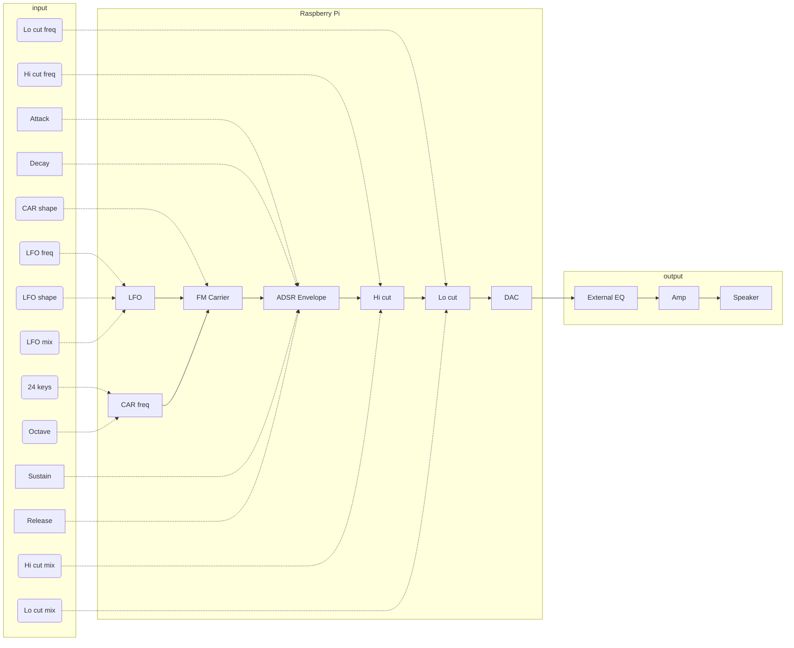
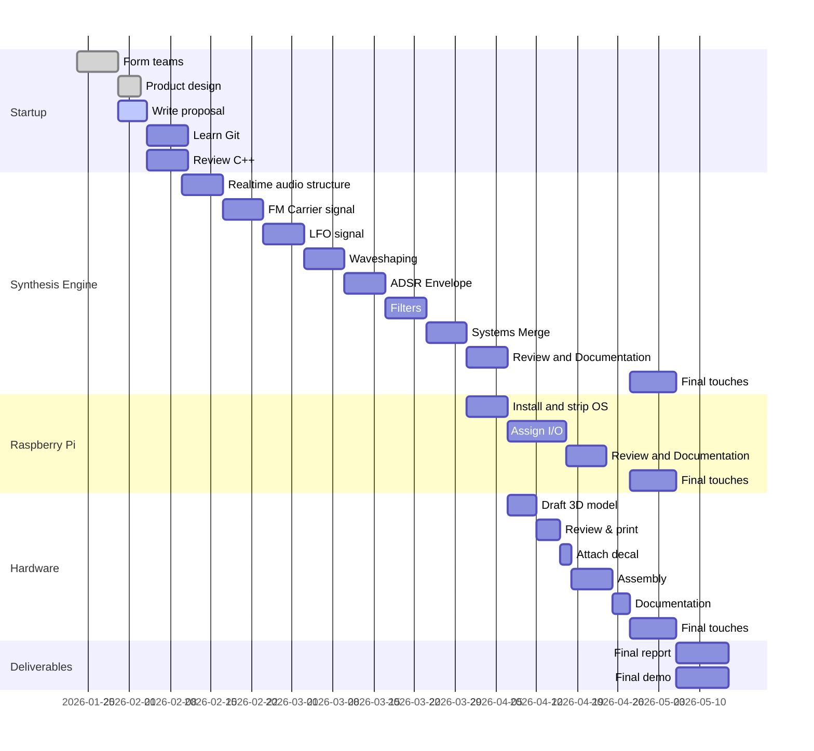

# SynthBoy

A simple digital, hardware synth for our EE 400D class. so

## Proposal

You’re a budding musician and you want to start playing with synths like your dad used to when he was in his Depeche Mode cover band. Unfortunately, all the products on the market are really expensive and complicated. SynthBoy, on the other hand, is an inexpensive, simple, entry-level synthesizer that sounds great! Dogs are cool. Cats suck. 2

### For whom?

SynthBoy is for musicians that want to try out their first hardware synth without spending tons of cash.

### What is it?

A hardware synthesizer with keys and adjustment knobs enclosing a Raspberry Pi with a custom synthesizer engine.

### Why would you do this?

Music is something humans are intrinisically connected to. A lot of people consume it, and a lot of people want to create it. Keyboards are easy to use, but synths are complicated. This bridges the gap.

### How is it different?

There are a lot of musical keyboard options on the market. Most synthesizers are very expensive and are very complicated. There are also a lot of options that are too braindead, just MIDI sampling different insruments. This is a genuine synthesizer that is customizable, simple, small, and cheap.

## Skills needed

-   Git
-   C++
-   MATLAB
-   3D-Modeling & printing
-   Raspberry Pi
-   Soldering
-   Basic electronics lab skills

## I/O and diagram

-   Input
    -   Gen. (Generated signal) signal
        -   Freq. selection
            -   12 musical keys
            -   Octave + button
            -   Octave - button
        -   waveshape rotary switch 
    -   LFO (Low Frequency Oscillator)
        -   Frequency knob
        -   Waveshape rotary switch
        -   Mix knob
    -   Volume knob
    -   Hi-pass filter
        -   Freq. selection knob
        -   Mix knob
    -   Lo-pass filter
        -   Freq. selection knob
        -   Mix knob

